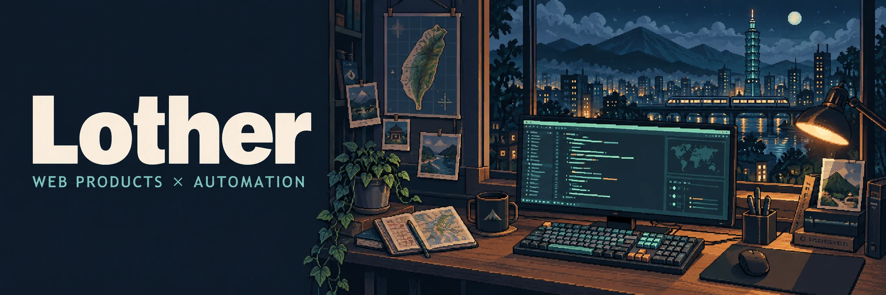

<!--
DIRECTION: Lother Lab — a mint-accented pixel-art maker studio, extending the existing avatar identity.
MODE: Experience. GitHub's native profile shell remains the delivery surface.
FIRST VIEWPORT: Full-width authored night-studio banner; ivory Lother lettering beside a travel-and-code desk.
SIGNATURE: A single restrained pulse connects idea, build, and ship; static labels remain visible and reduced motion stops the pulse.
CONSTRAINTS: Native GitHub Markdown/HTML only; all graphics are repository assets; no scripts, fake metrics, or external stats services.
FINISH: unreviewed and undocumented is unfinished; this build ends with the finish review, the verdict, DESIGN.md, and every shipping raster carrying its provenance.
-->

### Turning everyday friction into useful software.

I build travel web products, automation workflows, and practical developer tools — from the interface to the data layer and the recovery path.

把真實需求做成能使用的產品。喜歡旅遊、工具，以及把繁瑣流程變簡單的程式。

## Tools I reach for

  
  
  
  

  
  
  

## From the lab

### [TBTI Affiliate Agent](https://github.com/Lother13501350/tbti-affiliate-agent)

**A full-stack workflow, from product links to revenue.**

Affiliate product management, click tracking, CSV order imports, and revenue reporting. Platform adapters keep integrations separate; AI optimization proposals go through human review.

`TypeScript` `Next.js` `React` `PostgreSQL` `Neon`

### [PalRelay](https://github.com/Lother13501350/palrelay)

**One shared world. Friends take turns hosting.**

A Palworld toolkit with cloud save sync and a Windows desktop UI. Advisory locks coordinate hosts; versioned saves, integrity checks, and recovery flows protect game progress.

`PowerShell` `C# / WPF` `Python` `Google Drive` `Windows CI`

<b>More from the lab</b> — diagnostics, websites & tools

 

#### [pc-steward](https://github.com/Lother13501350/pc-steward)

AI-assisted Windows diagnostics with structured JSON evidence, approved startup changes, registry backups, and restore scripts.

`PowerShell` `Agent workflows` `Reversible actions`

#### [Travel Agency Website](https://github.com/Lother13501350/TravelAgency_Website_Example)

A responsive travel catalog with search, package filters, itinerary details, and a validated enquiry form demo.

`React` `TypeScript` `Vite` `Tailwind CSS`

#### [ChillOut Marketing Dashboard](https://github.com/Lother13501350/TREKX_Marketing)

A static marketing workspace with editable campaigns, content schedules, browser storage, and JSON / CSV exports.

`JavaScript` `HTML / CSS` `localStorage` `Static-site CI`

## How I build

Small scope. Clear docs. Useful software. Recoverable changes.

Explore the pinned repositories below for source code, setup instructions, and design notes.
