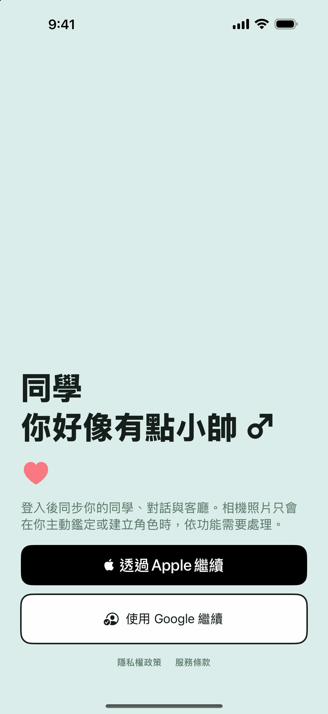
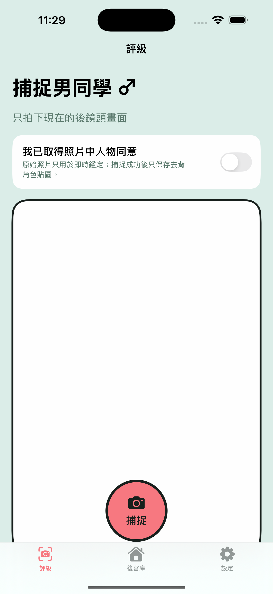
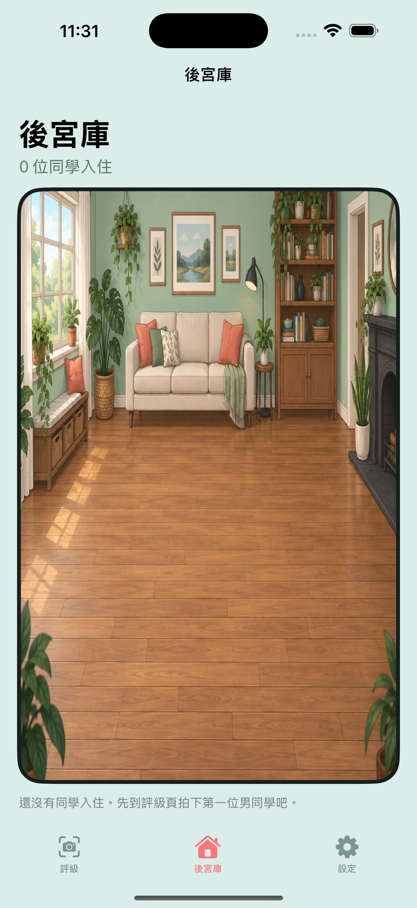
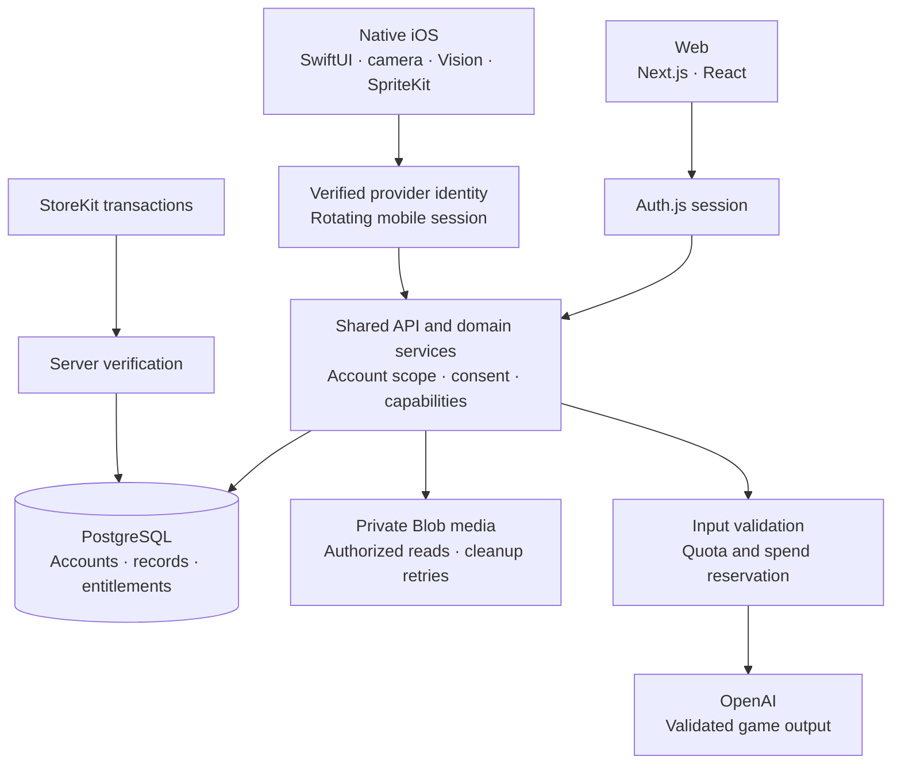

# Classmate

**A camera-based social game built across native iOS, web, and shared account services.**  
Product name: 同學你好像有點小帥 · Builder: [Lother](https://github.com/Lother13501350)

I implement and maintain the SwiftUI app, web workflows, backend services, and verification tooling. The product is in active development; the web entrance is hosted and the application source remains private.

[Hosted web entrance](https://classmate-you-look-a-little-handsom.vercel.app/) · [Verification notes](verification.md) · [Discuss this project](https://github.com/Lother13501350/Lother13501350/issues)

## Product and interface

Classmate turns a photo taken with the subject's permission into an entertainment character that can live in a private 2D room. The broader application includes friend photo interactions, fictional character conversations, and optional generated character images. Generated ratings and dialogue are game content; they do not establish a person's qualities or thoughts.

The core journey is **confirm permission → capture → analyze and create a cutout → name and collect → interact in the room**. The engineering challenge is carrying identity, private media, and permitted actions through that journey across two clients.

<table>
  <tr>
    <th>Sign in</th>
    <th>Permission and capture</th>
    <th>Private room</th>
  </tr>
  <tr>
    <td></td>
    <td></td>
    <td></td>
  </tr>
</table>

**Archived native UI, September 21, 2026.** These project screenshots show an earlier interface; the capture and room screens use empty preview states. They contain no personal photos or account records. They demonstrate the app's UI, not a completed authenticated flow or the current release's feature coverage. The room background is generated artwork. [Screenshot provenance](assets/README.md).

Current hosted web entrance — October 6, 2026

Captured from the public, signed-out application. Google sign-in is required to continue; this is the product entrance rather than an anonymous interactive demo.

## My contribution

- **Native product flow:** SwiftUI screens, AVFoundation capture, Vision person segmentation, SpriteKit room integration, Keychain session storage, and StoreKit integration.
- **Web and shared backend:** Next.js/React workflows, account-scoped API services, provider authentication, rotating mobile sessions, PostgreSQL records, and versioned SQL migrations.
- **Private media lifecycle:** image validation, private Blob storage, ownership/reference checks, deletion coordination, and retryable external cleanup.
- **AI and delivery controls:** consent and quota checks, spend reservations, constrained provider output, server-derived capabilities, Node tests, browser/native test targets, and build/release tooling.

I use AI-assisted development and review the resulting implementation through source inspection and executable checks. Generated artwork and provider-generated game content are separate from the application engineering described here.

## Architecture

The native app uses platform camera, segmentation, and room rendering. Both clients call shared server services; their feature coverage differs. PostgreSQL stores account state and permissions, while private Blob storage holds media. AI credentials and budget decisions stay on the server. Store purchases feed verified entitlement records from which the server derives capabilities.

## Three technical decisions

### 1. Share account identity while keeping native sessions explicit

**Problem:** web cookies and a mobile app need different session handling, but character collections must resolve to the correct account.

**Decision:** verify provider credentials on the server, map Google identity consistently across clients, and issue opaque mobile access/refresh tokens. The database stores token hashes; refresh rotates them inside a transaction with a row lock and a conditional update. Apple identity remains distinct unless explicitly linked.

**Tradeoff:** revocation and rotation require database coordination. Concurrent refreshes must not both reuse the old token. Identity/token tests cover domain rules; database concurrency remains a separate integration check.

### 2. Make media access depend on live account references

**Problem:** knowing an image path must not grant access, and deleting an account spans both a database and an external storage service.

**Decision:** validate image bytes and recorded asset metadata, authorize reads against ownership and live references, and check deletion tombstones before late writes. Account deletion revokes references and queues durable cleanup work in the database transaction; external Blob deletion follows after commit and can be retried.

**Tradeoff:** access can be revoked before physical storage cleanup finishes. Database and Blob operations are not one atomic transaction, so cleanup failures and orphaned assets need reconciliation. This avoids claiming that every external copy disappears immediately.

### 3. Bound AI work before calling the provider

**Problem:** photo analysis and image generation have different costs, and a model response must not decide balances or paid capabilities.

**Decision:** gate requests through applicable consent, input validation, quotas, and persisted daily/monthly spend reservations. The server validates model output and controls progression, image tickets, and entitlements. In production, missing spend configuration or storage prevents a provider call.

**Tradeoff:** reservations use conservative cost estimates. Once provider work begins, errors or timeouts still consume the reserved estimate because the request may be billable. Tests use a deterministic spend-store double; they do not prove real provider billing or PostgreSQL race behavior.

## Verification and remaining work

The October 6, 2026 local audit recorded **462 passed, 23 skipped, 0 failed** Node tests and a passing TypeScript check. The native app also compiled for a **physical iPhone target with signing disabled**. These results establish local checks and compilation; the test suite includes source/contract assertions, and skipped database paths were not verified.

Browser end-to-end tests, installation, purchases, push delivery, and current on-device interaction were not rerun in that audit. Fresh native screenshots are pending an available physical iPhone. [Verification notes](verification.md) distinguish these limits from the published UI and hosted web entrance.

The next release work is isolated database integration, signed physical-device acceptance, and dependency updates with regression checks. This case study describes implemented engineering in an actively developed product; it does not claim public App Store approval, usage metrics, or complete release readiness.

For a technical discussion, [open an issue](https://github.com/Lother13501350/Lother13501350/issues) about session rotation, media cleanup, or AI budget handling. The public material is this case study and reviewed screenshots; application source remains private.
